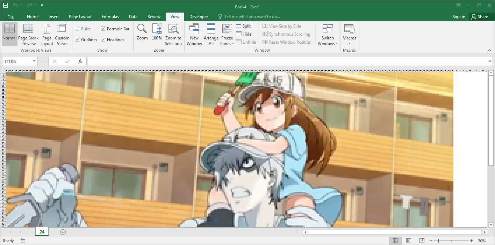

    <h1>pixCELL</h1>
    <h4>Turn your pictures into spreadsheets!</h4>
    
    <h6>Image: はたらく細胞 / Cells at Work!</h6>

## Usage

Grab *pixCELL.xlsm* from the *build* directory, enable macros and click on *Open Image*.

## Known Issues

- Excel only allows a specific number of unique cell formats on a workbook (4,000 in Excel 2003 and 64,000 in Excel 2007 and later versions)
